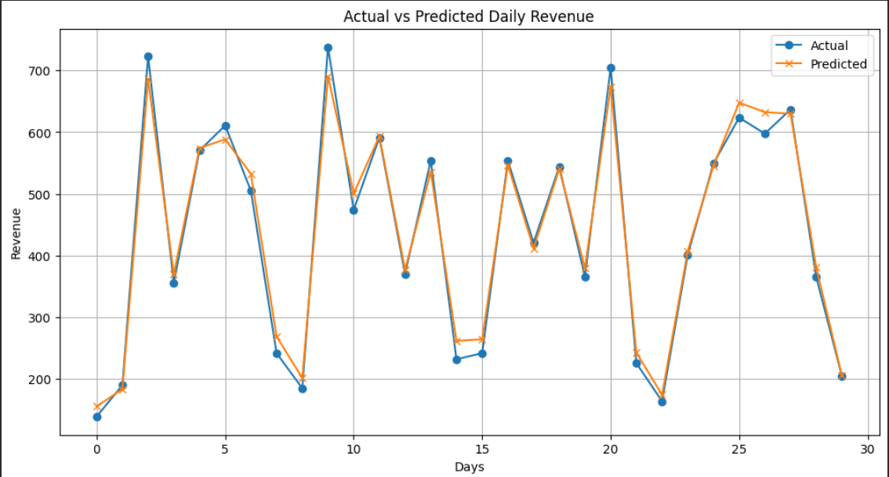

# AI Sales Prediction

## Project Overview
This project focuses on predicting daily coffee sales revenue using Machine Learning models.

The dataset contains transaction records from a coffee shop including:
- Date and time
- Payment type
- Customer card IDs
- Revenue
- Coffee product names

The main goal of this project is to analyze sales behavior and build predictive models capable of forecasting future daily revenue.

---

## Technologies Used
- Python
- Pandas
- NumPy
- Scikit-learn
- Matplotlib
- Google Colab

---

## Data Preprocessing
Several preprocessing steps were applied including:
- Handling missing values
- Converting date and time columns
- Feature engineering
- Creating time-based features such as:
  - Hour
  - Day of week
  - Month
- Creating lag features and rolling averages

---

## Machine Learning Models
The following regression models were tested:

- SVR
- KNN Regressor
- Decision Tree Regressor
- Linear Regression
- Ridge
- Lasso
- ElasticNet
- Neural Network (MLP Regressor)
- Random Forest Regressor
- Gradient Boosting Regressor
- AdaBoost Regressor

---

## Model Evaluation
The models were evaluated using:
- MSE
- MAE
- R² Score

The best performing model was:
### Gradient Boosting Regressor
with an R² score of approximately 0.987

---

## Results Visualization

The following graph compares the actual daily revenue with the predicted revenue generated by the best-performing model.

---

## Project Outcome
This project demonstrates:
- Data analysis skills
- Feature engineering
- Machine learning model comparison
- Regression prediction techniques
- Data visualization

---

## Author
Amna Bettar
